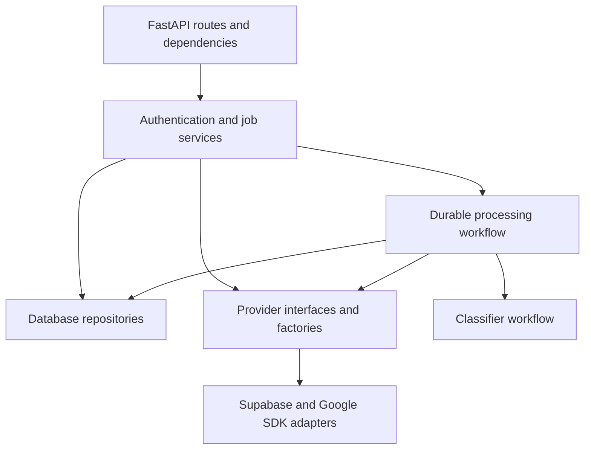

# Authentication and job integration

The backend combines provider adapters, application services and persistence to authenticate users and process durable jobs. This guide maps those layers to code. [System design](trx-system-design/README.md) explains the flows; [deployment](deployment/README.md) owns cloud setup procedures.

## Composition



| Source | Responsibility |
| --- | --- |
| [Auth routes](../src/api/authentication.py) | Current verified user. |
| [Dependencies](../src/api/dependencies.py) | Bearer-token verification, verified profile synchronization and Google caller authorization. |
| [Job routes](../src/api/jobs.py) | Submission, status, result, retry and event streaming. |
| [Internal routes](../src/api/internal.py) | Processing and maintenance requests. |
| [Authentication service](../src/services/authentication/) | Provider token verification and stream expiry checks. |
| [Job service](../src/services/jobs/postgres.py) | Uploads, job creation, outbox dispatch and maintenance. |
| [Job processing](../src/workflows/job_processing/workflow.py) | Claims, stage checkpoints, compatible resume and outcomes. |
| [Storage tools](../src/tools/object_storage/) | Immutable object keys and generation-pinned file operations. |
| [Queue tools](../src/tools/task_queue/) | Named deliveries, OIDC configuration and duplicate reconciliation. |
| [Repositories](../src/db/repositories/) | Ownership, transactions, job attempts, events, results and outbox. |

Services expose application capabilities such as authentication and job management. Tools perform operations used by those capabilities, such as document conversion, storage and queue delivery. Both use an interface, factory and implementation pattern.

```text
src/services/
├── authentication/
│   ├── interface.py   # Verified identities, token verification and expiry checks
│   ├── factory.py     # Select user or internal authentication implementation
│   ├── supabase.py    # Supabase settings and SDK verification
│   └── google.py      # Google service-token verification
└── jobs/
    ├── interface.py   # Submit, read, retry, process and maintain jobs
    ├── factory.py     # Construct the job implementation with its dependencies
    └── postgres.py    # Persist and coordinate jobs through PostgreSQL
```

The API depends on service interfaces and constructs implementations through factories. Supabase-specific settings stay in its implementation. PostgreSQL owns job state; Google Storage and Cloud Tasks are injected through their existing tool interfaces. Routes translate requests and responses. The durable processing wrapper reuses the classifier workflow. SDK objects stay inside adapters.

## Configuration and frontend integration

[`.env.example`](../.env.example) lists environment settings. Authentication settings and token verification are covered by [authentication deployment](deployment/authentication.md); database connections by [Database and Docker](database-and-docker/README.md); task identities by [Cloud Tasks](deployment/cloud-tasks.md).

The Supabase browser SDK manages sign-in and client sessions. API requests carry Bearer tokens through same-origin routing to FastAPI. Preserve Authorization headers and streaming through the hosting proxy. Internal routes are called directly by Google services.

## Local verification

Use [Docker setup and tests](database-and-docker/README.md#local-cli) for an isolated PostgreSQL database. Tests inject provider substitutes and do not provision cloud resources. Exercising real storage/task integrations from a development machine requires configured cloud resources and Application Default Credentials:

```sh
gcloud auth application-default login
```

Local startup and health checks do not establish successful hosted login or task delivery. Before deployment, verify the real provider flow using the [launch checks](deployment/README.md#launch-checks).

## Planned authentication review

- [ ] Evaluate switching authentication providers through application-owned interfaces (dependency inversion).

The current `AuthenticationService` interface and Supabase adapter provide a starting point. Review the boundary before treating another provider as interchangeable:

- Keep Supabase SDK types, configuration and validation inside its adapter/composition layer. Application callers should depend on the interface.
- Check whether the token verification contract works for another provider without changing application logic.
- Plan how stable application user IDs and frontend sign-in survive a provider migration.
- Validate the design with a second adapter and shared contract tests before claiming provider switching is supported.

Supabase is the only implemented user-authentication provider. Supporting another provider still requires an adapter and an identity-migration plan.
