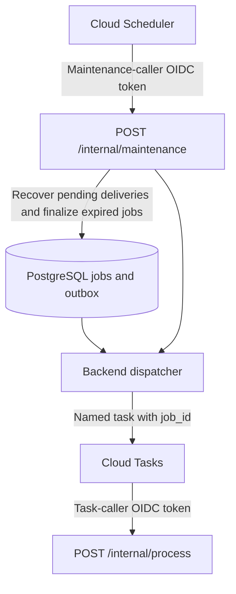

# Cloud Tasks and scheduled maintenance

Cloud Tasks delivers job references to FastAPI's processing route. Cloud Scheduler invokes maintenance to recover pending dispatch and finalize expired jobs. Both call the same backend using separate Google identities.

Complete the [bootstrap](README.md#google-cloud-bootstrap) first. [Architecture and jobs](../trx-system-design/01-architecture-and-services.md#recovery) owns the processing and recovery behavior.



## Create and authorize

The queue values below are starting examples. Measure capacity and coordinate queue retries with the application attempt/deadline policy before launch.

```sh
gcloud tasks queues create "$TASKS_QUEUE" --location="$TASKS_LOCATION" \
  --max-concurrent-dispatches=2 --max-dispatches-per-second=2 \
  --max-attempts=5 --min-backoff=10s --max-backoff=300s

gcloud iam roles create trxTaskDispatcher --project="$GOOGLE_CLOUD_PROJECT" \
  --title="TRX task dispatcher" \
  --permissions=cloudtasks.tasks.create,cloudtasks.tasks.get,cloudtasks.tasks.fullView \
  --stage=GA

gcloud tasks queues add-iam-policy-binding "$TASKS_QUEUE" --location="$TASKS_LOCATION" \
  --member="serviceAccount:$RUNTIME_EMAIL" \
  --role="projects/$GOOGLE_CLOUD_PROJECT/roles/trxTaskDispatcher"

gcloud iam service-accounts add-iam-policy-binding "$TASK_CALLER_EMAIL" \
  --member="serviceAccount:$RUNTIME_EMAIL" --role=roles/iam.serviceAccountUser

gcloud tasks queues describe "$TASKS_QUEUE" --location="$TASKS_LOCATION"
```

Creation needs `tasks.create`; exact duplicate reconciliation also needs `tasks.get` and `tasks.fullView`. The runtime must be allowed to use the task-caller service account. Keep Google's managed Cloud Tasks service-agent role intact so Google can mint identity tokens.

## Application configuration

[Cloud Run](cloud-run.md) maps `GOOGLE_CLOUD_PROJECT`, `TASKS_LOCATION`, `TASKS_QUEUE`, `BACKEND_URL`, `TASK_CALLER_EMAIL` and `MAINTENANCE_CALLER_EMAIL` into the backend.

The [queue adapter](../../src/tools/task_queue/google.py) sends POST `BACKEND_URL/internal/process`, JSON `{ "job_id": "UUID" }`, and an OIDC token whose audience is `BACKEND_URL`. Files remain in Storage. The adapter sets a 1,800-second dispatch deadline. The [job configuration](../../src/config.py) requires a shorter application processing timeout; these budgets are currently code defaults, not environment overrides.

The backend verifies service tokens against `BACKEND_URL`, matching the audience used by Tasks and Scheduler. Caller identities need no database, Storage or AI credentials.

The queue limits outstanding requests, not surviving computation after timeout. Cloud Tasks may deliver duplicates and does not guarantee ordering. [Delivery limitations](https://cloud.google.com/tasks/docs/common-pitfalls)

## Scheduled maintenance

After [Cloud Run deployment](cloud-run.md) sets `BACKEND_URL`, create the schedule using the maintenance identity. The one-minute cadence is an example; choose it with the recovery latency and database load in mind.

```sh
gcloud scheduler jobs create http trx-maintenance \
  --project="$GOOGLE_CLOUD_PROJECT" --location="$TASKS_LOCATION" \
  --schedule="* * * * *" \
  --uri="$BACKEND_URL/internal/maintenance" \
  --http-method=POST \
  --oidc-service-account-email="$MAINTENANCE_CALLER_EMAIL" \
  --oidc-token-audience="$BACKEND_URL"
```

The deploying identity needs `iam.serviceAccounts.actAs` on the maintenance caller. Keep Google's managed Scheduler service-agent role intact. The backend checks the exact maintenance identity independently of the task caller. [Scheduler authentication](https://cloud.google.com/scheduler/docs/http-target-auth)

Maintenance examines persisted recovery state and deadlines; it does not poll browser progress. A durable schedule is required because an in-process loop cannot run while Cloud Run has scaled to zero.

## Verify

1. Reject missing tokens, wrong audiences, and swapped task/maintenance identities.
2. Submit more jobs than queue concurrency and confirm the configured dispatch limit.
3. Repeat delivery while processing and after completion; verify 409 for an active duplicate and 204 for a terminal job.
4. Fail enqueue, lose a task-creation response, and exercise a reserved task name. Verify outbox reconciliation/recovery.
5. Interrupt processing after a checkpoint and verify compatible resume within the remaining budget.
6. Exhaust retries or kill the handler before it saves failure. Verify scheduled maintenance persists a terminal outcome.
7. Lose acknowledgment after result commit and verify another delivery does not repeat model calls.

[Queue settings](https://cloud.google.com/tasks/docs/configuring-queues), [task creation](https://cloud.google.com/tasks/docs/creating-http-target-tasks), and [HTTP task deadlines](https://cloud.google.com/tasks/docs/reference/rest/v2/projects.locations.queues.tasks).
