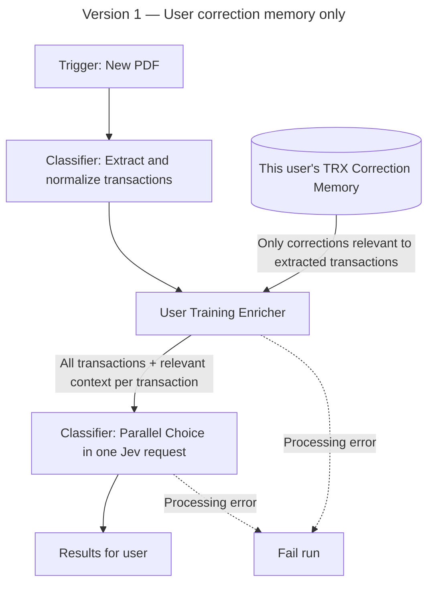
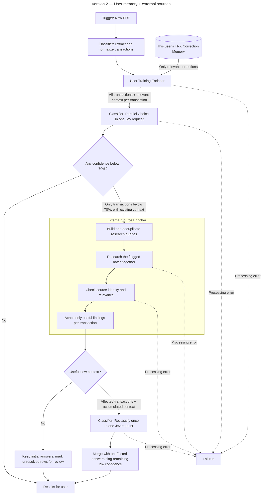
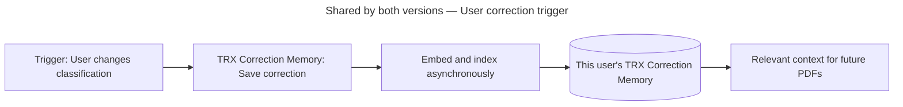

```mermaid
---
title: Version 1 — User correction memory only
---
flowchart TD
    PDF[Trigger: New PDF] --> EX[Classifier: Extract and normalize transactions]
    EX --> TRAIN[User Training Enricher]
    MEMORY[(This user's TRX Correction Memory)] -->|Only corrections relevant to extracted transactions| TRAIN
    TRAIN -->|All transactions + relevant context per transaction| CLASSIFY[Classifier: Parallel Choice in one Jev request]
    CLASSIFY --> RESULTS[Results for user]
    TRAIN -.->|Processing error| ERROR[Fail run]
    CLASSIFY -.->|Processing error| ERROR
```

```mermaid
---
title: Version 2 — User memory + external sources
---
flowchart TD
    PDF[Trigger: New PDF] --> EX[Classifier: Extract and normalize transactions]
    EX --> TRAIN[User Training Enricher]
    MEMORY[(This user's TRX Correction Memory)] -->|Only relevant corrections| TRAIN
    TRAIN -->|All transactions + relevant context per transaction| CLASSIFY[Classifier: Parallel Choice in one Jev request]
    CLASSIFY --> CHECK{Any confidence below 70%?}
    CHECK -->|No| RESULTS[Results for user]
    CHECK -->|Only transactions below 70%, with existing context| QUERIES

    subgraph EXTERNAL[External Source Enricher]
        QUERIES[Build and deduplicate research queries] --> RESEARCH[Research the flagged batch together]
        RESEARCH --> VERIFY[Check source identity and relevance]
        VERIFY --> CONTEXT[Attach only useful findings per transaction]
    end

    CONTEXT --> NEW{Useful new context?}
    NEW -->|No| REVIEW[Keep initial answers; mark unresolved rows for review]
    NEW -->|Affected transactions + accumulated context| AGAIN[Classifier: Reclassify once in one Jev request]
    AGAIN --> MERGE[Merge with unaffected answers; flag remaining low confidence]
    MERGE --> RESULTS
    REVIEW --> RESULTS
    TRAIN -.->|Processing error| ERROR[Fail run]
    CLASSIFY -.->|Processing error| ERROR
    RESEARCH -.->|Processing error| ERROR
    VERIFY -.->|Processing error| ERROR
    AGAIN -.->|Processing error| ERROR
```

```mermaid
---
title: Shared by both versions — User correction trigger
---
flowchart LR
    USER[Trigger: User changes classification] --> TRAIN[TRX Correction Memory: Save correction]
    TRAIN --> INDEX[Embed and index asynchronously]
    INDEX --> MEMORY[(This user's TRX Correction Memory)]
    MEMORY --> NEXT[Relevant context for future PDFs]
```
