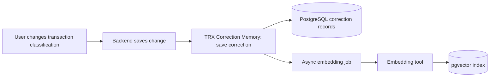
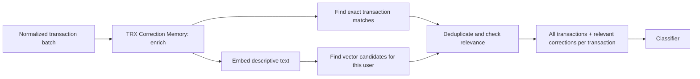

# TRX Correction Memory





## Summary

- Deferred add-on; documentation only. First provider: PostgreSQL + pgvector.
- Two operations: save a user correction; enrich a transaction batch.
- Preserve every input transaction, its fields, and order. No match means empty context.
- Corrections are evidence for classification, not model training or automatic rules.
- Scope retrieval to the user. Matching a merchant alone is insufficient.
- Embed descriptive transaction text; retain date, amount, installment fields and correction values as structured data.
- Save the record and indexing job atomically. Use IDs/versions for duplicate events, newer edits and stale embedding jobs.
- Retrieve once per workflow run; reuse context during reassessment. Provider errors propagate.

## Classification dimensions

Store which classification field changed, independently of its value:

| Dimension | Examples | Status |
| --- | --- | --- |
| `report_bucket` | `fixed`, `variable`, `movements`, `installments` | Current |
| `spending_category` | `food`, `car`, `entertainment` | Future |

A transaction can be both `fixed` and `entertainment`. A correction to one dimension must not overwrite the other. Validate values against the requested dimension's taxonomy.

## Code example

Contract sketch; reuse the application's normalized transaction model during implementation.

```python
@dataclass(frozen=True)
class TrxCorrection:
    id: str
    user_id: str
    transaction: NormalizedTransaction
    dimension: str
    previous_value: str
    corrected_value: str
    version: int


@dataclass(frozen=True)
class EnrichedTransaction:
    transaction: NormalizedTransaction
    corrections: list[TrxCorrection]


class TrxCorrectionMemory(ABC):
    @abstractmethod
    async def save(self, correction: TrxCorrection) -> None: ...

    @abstractmethod
    async def enrich(
        self,
        user_id: str,
        transactions: list[NormalizedTransaction],
        dimensions: set[str],
    ) -> list[EnrichedTransaction]: ...
```

```python
memory = trx_correction_memory_factory("postgres")

enriched = await memory.enrich(
    user_id=user_id,
    transactions=transactions,
    dimensions={"report_bucket"},
)
```

The factory supplies configured dependencies. The provider owns retrieval, relevance checks and attachment. Embedding model and relevance thresholds remain to be evaluated.

## Planned structure

```text
src/tools/
├── trx_correction_memory.py          # Interface and contract
├── trx_correction_memory_factory.py
└── postgres/
    ├── trx_correction_memory.py      # Provider
    ├── queries.py
    └── indexing.py
```

Provider folders live directly under `tools/`; no `providers/` folder.
