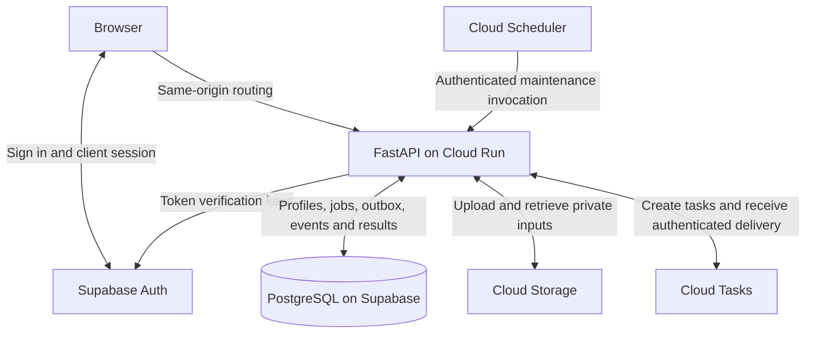
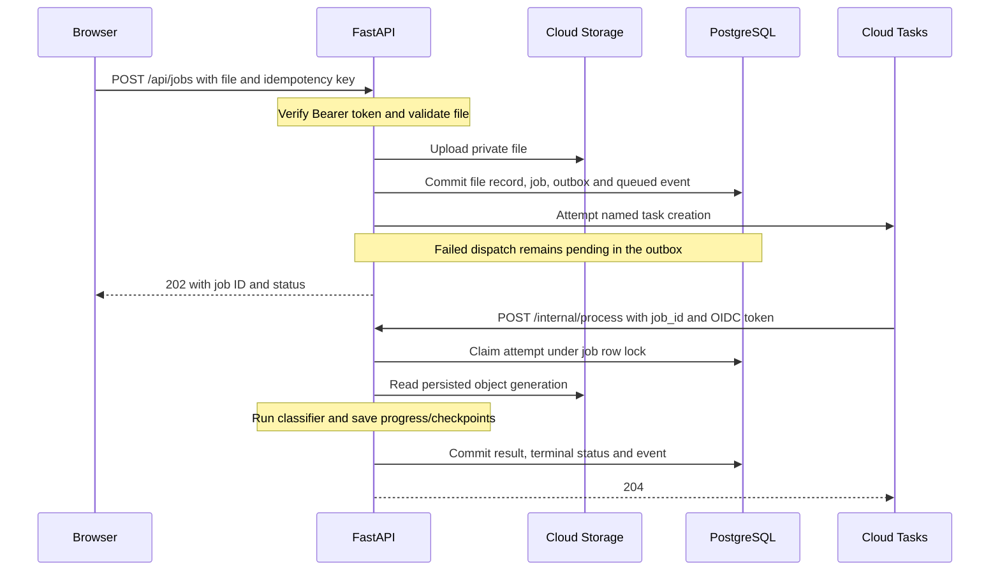
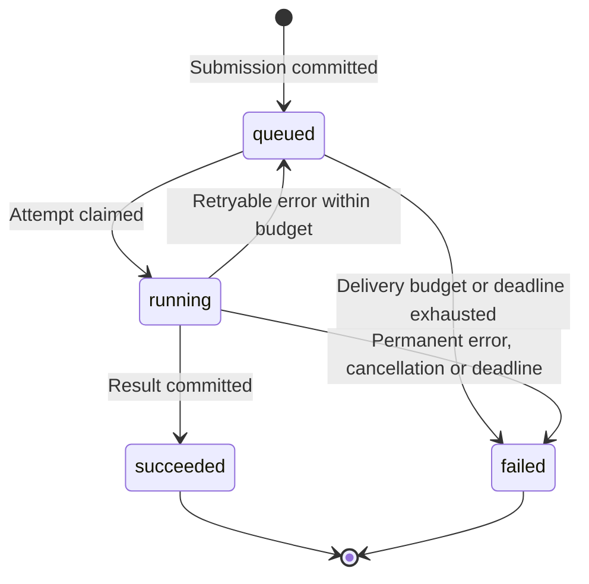

# Architecture and jobs

FastAPI accepts a statement file, stores a job, and asks Cloud Tasks to deliver a processing request. The browser reads progress separately. Closing the browser does not cancel the job.

## Services and data

| Component | Responsibility |
| --- | --- |
| Browser | Authenticate, submit a file, retain its job ID, and display progress and results. |
| Job service | Save uploads, create jobs and enqueue intents, dispatch tasks, and run maintenance. |
| Cloud Tasks | Deliver processing requests with queue rate and retry controls. |
| Processing workflow | Claim an attempt, retrieve the file, run conversion/extraction/classification, and persist checkpoints and outcomes. |
| PostgreSQL | Store ownership, user profiles, job state, attempts, ordered events, checkpoints, outbox intents, and results. |
| Cloud Storage | Store private input files under immutable object names. |
| Cloud Scheduler | Invoke maintenance even when Cloud Run has no active instance. |

## Submission and processing

The file upload and database commit are separate operations. If a commit outcome is unknown, the service retains the private object because a committed job may reference it. Retention reconciliation must handle abandoned objects separately.

A submission key is scoped to the authenticated user. Repeating the same submission returns its existing job; reusing the key for another file or retry is rejected. Identical files with different keys can create separate jobs.

## Job states

A user retry of a failed job creates a new linked job. It does not reopen the original job. Cancellation in this diagram means processing cancellation by the server; there is no user cancellation endpoint.

## Recovery

| Situation | Behavior |
| --- | --- |
| Job committed, task creation fails or is uncertain | Retry the persisted outbox intent. Reconcile an existing task by its request contents. |
| Google remembers a task name after deleting the task | Save a fresh delivery intent within the recovery policy. |
| Duplicate delivery while an attempt is active | Return retryable 409. |
| Delivery after success or failure | Return 204 without running the classifier again. |
| Retryable processing error | Release the attempt and return 503 while attempts and time remain. |
| Saved stage from a previous attempt | Resume only when input, workflow, model and schema versions match. |
| Deadline or attempt budget exhausted | Commit failure and a safe error event. Maintenance finalizes jobs whose handler did not save an outcome. |
| Old attempt tries to write | Reject it unless its attempt ID, claim and deadline are still valid. |

The processing deadline is reduced when work first starts and is not reset by automatic retries. A timeout ends that job; an explicit user retry gets a new deadline. Completed stages can be reused, but an interrupted stage may run again and incur another provider charge. The application wrapper does not implement a separate provider retry loop; SDK retry behavior depends on each adapter.

Queue concurrency limits outstanding dispatches. It does not guarantee that timed-out provider calls have stopped. Attempt checks protect database writes; the implementation has no global worker-slot coordinator. Cloud Tasks also does not guarantee execution order. [Delivery limitations](https://cloud.google.com/tasks/docs/common-pitfalls)

## Interfaces and source

[API reference](../trx-classifier-contract.md#http-api) lists the routes. Implementation: [job service](../../src/services/jobs/postgres.py), [processor](../../src/workflows/job_processing/workflow.py), [job repository](../../src/db/repositories/jobs.py), and [task adapter](../../src/tools/task_queue/google.py).

[Events](02-events-and-live-updates.md) explains progress delivery. [Cloud Tasks deployment](../deployment/cloud-tasks.md) owns queue and maintenance setup.
