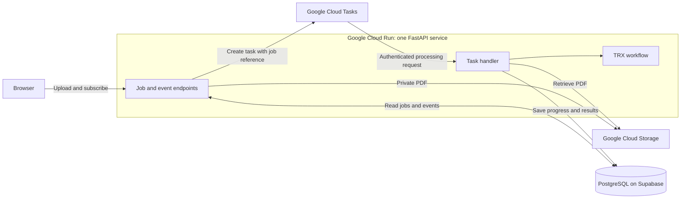
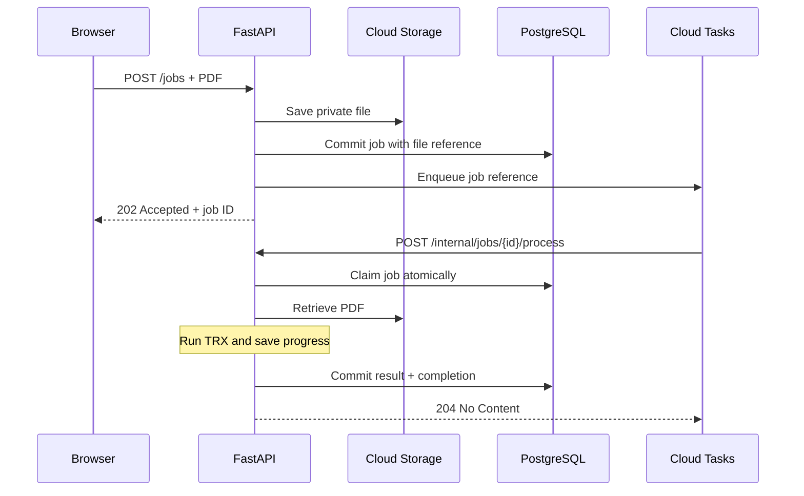

# 1. Architecture and services

**Separate accepting work, executing work, and watching work.** Each Portable Document Format (PDF) file has its own job; the browser connection does not own its processing lifetime.

## Pieces

| Piece | Owns |
| --- | --- |
| Browser | Submission, active-job discovery, progress, results |
| Job endpoint | Orchestrating file save, job creation, task enqueueing |
| File adapter | Saving and retrieving private PDFs |
| Job/event repository | Ownership, atomic claims, state, results, event history |
| Task handler | Executing a claimed job and consuming workflow events |
| TRX workflow | Convert → extract structured data → classify |
| Cloud Tasks | Dispatch rate, processing concurrency, delivery retries |

The handler is the **worker role**; the service can keep its name `agent-trx-classifier`.

## Successful path

Task dispatch and browser event subscription are independent. Either can happen first.

## Endpoint contract

Application Programming Interface (API) route names are illustrative.

| Route | Responsibility |
| --- | --- |
| `POST /jobs` | Save file/job, enqueue, return job ID |
| `GET /jobs?active=true` | Find this user's unfinished jobs |
| `GET /jobs/{id}` | Return persisted status/result |
| `GET /jobs/{id}/events` | Replay and stream authorized events |
| `POST /internal/jobs/{id}/process` | Claim and execute queued work |

**Batching:** one job per PDF. Grouping does not merge job lifetimes. The exact multi-file request and group-retry contracts remain open.

## Failure boundaries to resolve

| Failure | Required behavior |
| --- | --- |
| Job committed; enqueue fails | Recover the pending dispatch; specify an outbox or equivalent |
| Task delivered twice | Atomic claim; completed jobs acknowledge without repeating effects |
| Attempt times out | Recover abandoned claims; prevent stale attempts overwriting newer results |
| Retries exhausted | Persist an explicit failed state |

Queue order is not a strict first-in, first-out guarantee. A timeout does not guarantee computation stopped. Hypertext Transfer Protocol (HTTP) task attempts have a maximum dispatch deadline of 30 minutes; choose application and platform budgets deliberately. [Cloud Tasks pitfalls](https://docs.cloud.google.com/tasks/docs/common-pitfalls), [task deadlines](https://docs.cloud.google.com/tasks/docs/reference/rest/v2/projects.locations.queues.tasks)

[Transactional outbox: recover the save/enqueue gap](https://docs.aws.amazon.com/prescriptive-guidance/latest/cloud-design-patterns/transactional-outbox.html) · [Next: events](02-events-and-live-updates.md)
