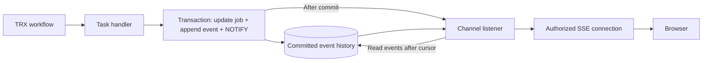

# 2. Events and live updates

**Server-Sent Events (SSE) deliver progress; PostgreSQL stores history and signals changes.** We chose notifications rather than periodic database polling.

## History plus a doorbell



| Mechanism | Responsibility |
| --- | --- |
| Event history | Durable name, timestamp, output, identity, ordering |
| `NOTIFY job_updates` | Small signal containing a job reference |
| `LISTEN job_updates` | Receive signals across backend instances |
| Local subscription | Route a job's events to browsers connected to this process |
| SSE | Send events through an open Hypertext Transfer Protocol (HTTP) response |

A commit alone does not notify. Issue `NOTIFY` explicitly in the same transaction as the saved event. Notifications become deliverable after commit. [PostgreSQL notifications](https://www.postgresql.org/docs/current/sql-notify.htm)

## Event contract

Use JavaScript Object Notation (JSON) for saved event data and stream payloads.

```json
{
  "event_id": "evt_abc",
  "job_id": "job_123",
  "attempt_id": "attempt_2",
  "sequence": 13,
  "name": "step_completed",
  "occurred_at": "2026-10-08T14:30:00Z",
  "data": { "step": "extract", "transaction_count": 99 }
}
```

Sequence is ordered **per job**, including across attempts. Allocate it safely so committed events cannot later appear behind an already advanced cursor. The event adapter records timestamps and maps meaningful workflow outputs into this contract.

```text
id: 13
event: step_completed
data: {"occurred_at":"2026-10-08T14:30:00Z","data":{"step":"extract"}}

```

The final blank line completes an SSE frame. Full output belongs in saved event data, not the notification payload.

## Connect without missing updates

```mermaid
sequenceDiagram
    participant B as Browser
    participant E as Event endpoint
    participant L as Shared listener
    participant D as PostgreSQL
    B->>E: GET /jobs/{id}/events + last applied sequence
    Note over E: Authenticate and check ownership
    E->>L: Ensure LISTEN ready; register local subscriber
    Note over L: Buffer signals while history loads
    E->>D: Read snapshot + events after cursor
    E-->>B: Replay history
    L->>D: On notification, read events after cursor
    L-->>E: New saved events
    E-->>B: SSE update
```

- **Refresh:** discover active jobs and reconnect. Rebuild the interface from a snapshot or replay; a stored cursor alone does not rebuild it.
- **Overlap:** deduplicate event IDs/sequences; advance the client cursor after applying an event.
- **Listener reconnect:** re-establish listening, then catch up from history.
- **Coalesced notifications:** drain all events after the cursor, not just one event per signal.
- **Slow browser:** bounded buffers; reconnect and replay if it falls behind.
- **Completion:** send `done`, close the stream, release the local subscription.

## Connection choices

One listener per backend process, not per browser. Use a direct or supported session-mode database connection; transaction pooling does not preserve `LISTEN` session state. [PostgreSQL listening](https://www.postgresql.org/docs/current/sql-listen.html), [Supabase connection modes](https://supabase.com/docs/guides/troubleshooting/supavisor-faq-YyP5tI)

Use the existing fetch-based stream approach for bearer authentication. Native `EventSource` does not offer a custom authorization-header option. Heartbeats keep the stream active without querying the database. [SSE specification](https://html.spec.whatwg.org/multipage/server-sent-events.html)

[Next: security](03-security-and-identity.md)
