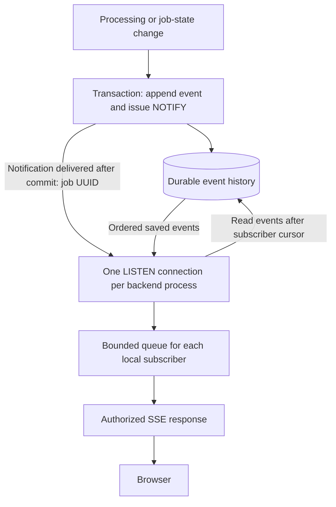
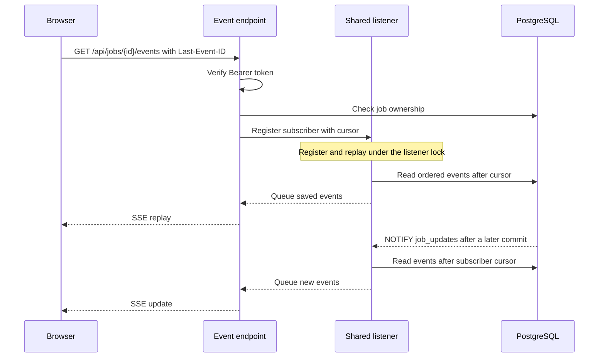

# Events and live updates

PostgreSQL stores ordered job events. Server-Sent Events (SSE) delivers those events to an authenticated browser. Database notifications signal that history has changed; they are not the event history.

## From processing to the browser



Event sequence numbers increase within each job, across attempts. Writers lock the job row while allocating a sequence and retain the lock through commit. Job-state changes and their events commit together; checkpoints are saved in separate transactions.

The application explicitly calls `pg_notify('job_updates', job_id)` in the event transaction. PostgreSQL delivers notifications after commit and may combine identical signals from one transaction. The listener reads all missing events rather than assuming one signal means one event. [PostgreSQL notification behavior](https://www.postgresql.org/docs/current/sql-notify.html)

## Stored records and wire format

The stored [event model](../../src/db/models/events.py) contains `id`, `job_id`, `attempt_id`, `sequence`, `event_type`, `data`, and `created_at`. The SSE response sends the sequence as `id`, the type as `event`, and only the saved `data` as JSON:

```text
id: 13
event: step_completed
data: {"step_id":"extract","name":"Extract transactions","elapsed_seconds":2.5,"output_type":"json","output":{}}

```

This is a format example; output contents depend on the workflow stage. The final blank line completes the frame. The stream does not wrap data in event IDs, timestamps or attempt metadata.

| Event | Data |
| --- | --- |
| `job_queued`, `job_started` | Empty object; identify job lifecycle changes. |
| `step_started` | `step_id` and readable `name`. |
| `step_completed` | Step identity, elapsed time, and output/type when supplied by the stage. Resumed stages include `resumed: true`. |
| `result` | Complete classifier result. Closes the stream. |
| `error` | Safe `code` and `reason`. Closes the stream. |
| `session_expired` | Empty object; generated by the stream, not persisted. Closes the stream. |

The `complete` step reports timing without another full result. There is no `done` event. Heartbeats are SSE comments (`: heartbeat`), not saved events.

## Subscription and replay



The dedicated listener executes `LISTEN` before catching up subscriptions when it connects or reconnects. Subscription registration and replay use the same lock as notification delivery to avoid overlapping delivery. If notifications are missed during a database disconnect, reconnect catch-up reads durable history.

The browser sends the last applied sequence in `Last-Event-ID`; absent a cursor, replay starts from zero. Deduplicate by sequence and advance the browser cursor after applying each event. A refreshed page must rebuild its display from replay or persisted status/result; a cursor alone does not restore the display.

The API currently has no active-job listing route. Clients must retain job IDs or obtain them through another application feature.

## Connection lifetime

- One dedicated, session-capable database listener serves all local streams. Transaction pooling cannot preserve `LISTEN` state.
- Progress is read on subscription, notification and listener reconnect. Heartbeats do not query job progress.
- An open stream checks access-token expiry periodically and sends `session_expired` before closing. Supabase logout does not immediately invalidate issued access tokens; the client should close its streams when signing out.
- Each stream has a bounded queue. Overflow closes the stream so a client can reconnect and replay.
- Terminal events close the stream; disconnects release the subscription. Cleanup runs in a worker thread and is shielded from stream cancellation so listener locks do not block other requests. An already-terminal job with no remaining history also closes without a new terminal frame.
- Configure the frontend proxy to preserve streaming and disable buffering. Clients must reconnect after network or platform request timeouts.

Frontend stream requests carry a Bearer token and reconnect with `Last-Event-ID`. See the [API stream](../../src/api/jobs.py), [listener](../../src/db/listener.py), and [event repository](../../src/db/repositories/events.py) for implementation.

[Security](03-security-and-identity.md) explains authentication and ownership. [Supabase deployment](../deployment/supabase.md) covers listener connections.
