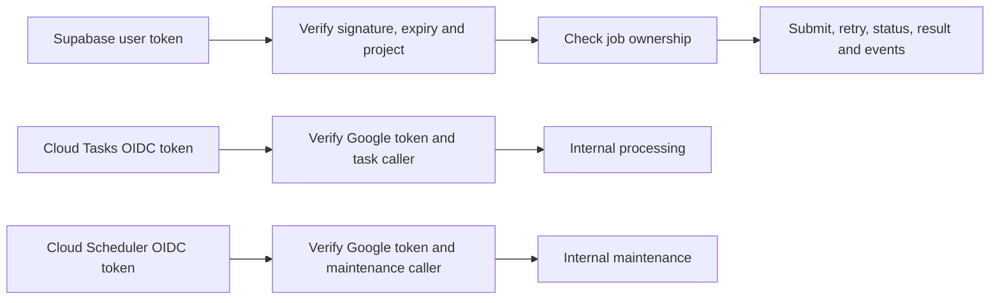
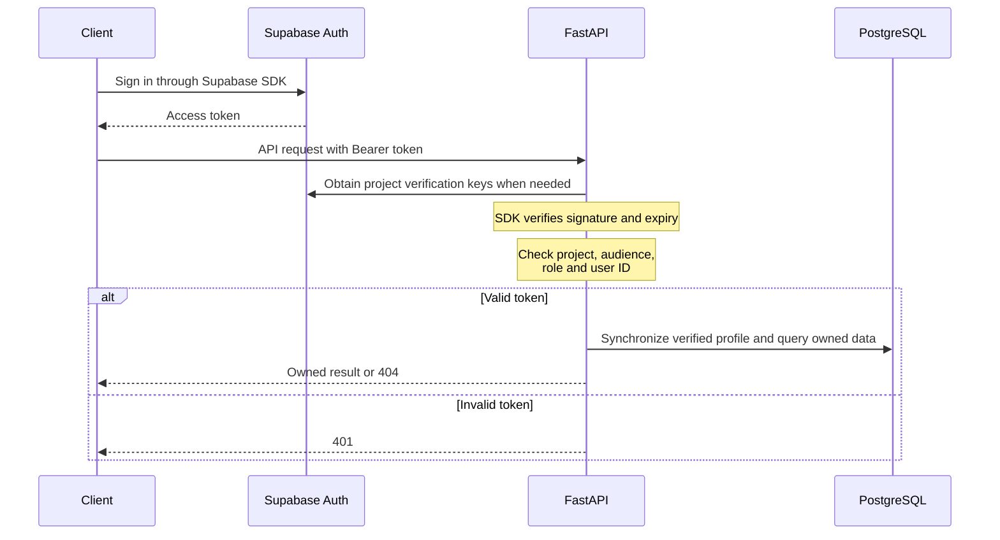

# Security and identity

User requests carry Supabase access tokens. Processing and maintenance requests carry Google service identity tokens. FastAPI verifies the identity required by each route.

## Trust boundaries

Owner IDs come from verified authentication. Repository queries scope access to that owner. A user-supplied owner ID is never a source of identity. Supabase authentication establishes identity; application ownership checks enforce access to jobs.

## User authentication

Supabase manages client sessions. FastAPI verifies each incoming token through the provider interface and stores no tokens or custom login sessions. Its adapter uses `get_claims()`, which caches asymmetric signing keys and falls back to Auth-server validation for legacy symmetric tokens.

The backend uses the verified user ID and email and ignores profile-name metadata. Profile synchronization does not write the optional database display-name column. The existing `/auth/me` name field is `null` for Supabase users.

Expired tokens receive 401. Open streams check expiry periodically and close with `session_expired`. Logout through the client SDK does not instantly invalidate an issued token; it can remain valid until expiry. Claims are a snapshot of identity/permissions when issued, not a live lookup of user changes.

The backend connects directly to PostgreSQL as `postgres`. Token verification does not automatically attach the user's identity to that connection or activate user-specific RLS. Existing ownership checks remain required.

[Authentication setup](../deployment/authentication.md) covers provider settings, frontend integration and verification.

## Service identity

The backend verifies Google's token signature, issuer, expiry, audience, verified email and exact allowed caller email. Processing and maintenance use separate caller identities. Task request headers alone do not authenticate a request.

Cloud Tasks receives the target `/internal/process`, caller service-account email and backend origin as audience. Google supplies the identity token when delivering the task. Cloud Scheduler invokes `/internal/maintenance` with its own identity.

The service is publicly reachable at the Cloud Run transport layer; FastAPI enforces these route checks. Supabase user tokens cannot authorize internal routes. [Queue and maintenance setup](../deployment/cloud-tasks.md)

## Data access

| Identity | Access |
| --- | --- |
| Browser user | Own job status, results, replay and mutations through FastAPI. |
| Runtime service account | Private bucket operations, task creation/reconciliation, and configured secrets. |
| Task caller | Authenticated processing route; no database or storage credentials required. |
| Maintenance caller | Authenticated maintenance route; no database or storage credentials required. |
| Database role (`postgres`) | Application reads/writes and schema administration. FastAPI enforces user ownership; this role also runs migrations. |

Files use immutable object names and generation-pinned reads/deletes. Retention and deletion need a defined operational policy; there is no public file-download or user cancellation endpoint.

Implementation: [authentication service](../../src/services/authentication/), [route guards](../../src/api/dependencies.py), [Google verifier](../../src/services/authentication/google.py), and [storage adapter](../../src/tools/object_storage/google.py).
