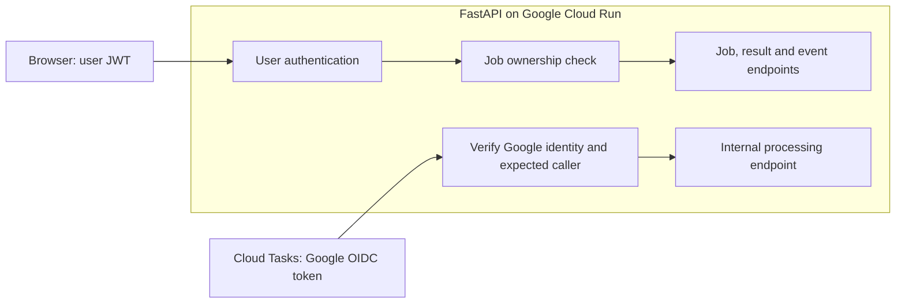
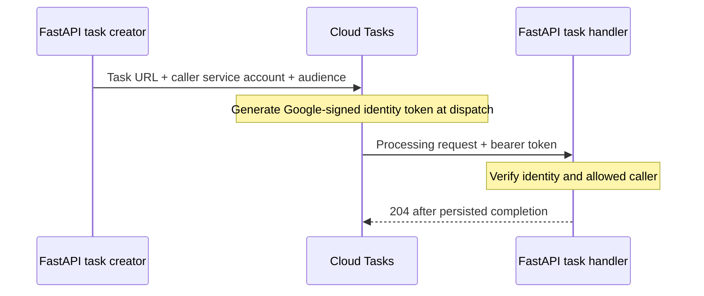

# 3. Security and identity

**Two caller identities enter one FastAPI service. Each route verifies the appropriate identity.**

## Trust boundaries

A JSON Web Token (JWT) proves identity only after its signature and claims are verified. OpenID Connect (OIDC) is the mechanism Google Cloud Tasks uses for its identity token.



| Route family | Required checks |
| --- | --- |
| Upload | Valid user identity; assign owner server-side |
| Job/status/result | Valid user identity; requested job belongs to that user |
| Event stream/replay | Same ownership checks before exposing history or subscribing |
| Task processing | Google signature, issuer, expiry, audience, verified expected service-account identity |

A browser user token must not authorize the internal task endpoint. A task service account is not a substitute for the browser user's identity.

## Cloud Tasks identity



| Setting | Meaning | Illustrative value |
| --- | --- | --- |
| Task target | Exact processing endpoint | `https://SERVICE.run.app/internal/jobs/A/process` |
| Service-account email | Authorized machine caller | `trx-task-caller@PROJECT.iam.gserviceaccount.com` |
| Audience | Intended receiver, checked by FastAPI | `https://SERVICE.run.app` |

Do not put a browser token in the task: it can expire before execution or retry. [Authenticated task creation](https://docs.cloud.google.com/tasks/docs/creating-http-target-tasks)

## Cloud Run and application authentication

Cloud Run Identity and Access Management (IAM) applies to the **service**, not selected routes.

For the agreed single-service design with ordinary user JWTs, the service is publicly reachable and FastAPI enforces route-specific authentication. Public reachability does not grant access to jobs or internal processing. [End-user authentication](https://docs.cloud.google.com/run/docs/authenticating/end-users)

## Storage and internal permissions

```text
Browser identity → authorized FastAPI routes
Backend identity → private file storage + task creation
Task caller      → internal processing route
Database role    → required job/event operations
```

- Derive owner from verified identity, never a submitted owner field.
- Keep bucket objects private; authorize any PDF download.
- Keep database credentials and machine credentials server-side.
- Apply least privilege to backend and task identities.
- Protect all listeners, results, and replay paths consistently.

**Still to specify:** token-expiry handling for long streams, authentication transport details, cancellation permissions, and any temporary file-download mechanism.

[Existing authentication visualization](../../../../docs/trx-classifier-authentication.html) · [Next: capacity and cost](04-capacity-and-cost.md)
