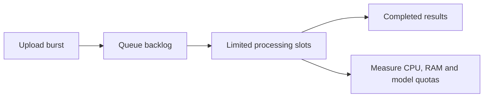

# 4. Capacity and cost

**Size for arriving work and simultaneous execution—not registered users.** Estimates below are planning scenarios, not load-test results.

Prices checked October 8, 2026. United States dollars (USD); Iowa (`us-central1`); before taxes.

## What we measured

| Earlier test | Observation |
| --- | --- |
| Browser Portable Document Format (PDF) workflow | 213 seconds; 99 transactions |
| Separate evaluation | 236 seconds |
| Categorization step | Approximately 0.6 seconds |

These observations do not establish cloud performance, peak memory, or safe concurrency. [Recorded evaluation](https://smith.langchain.com/o/2126d3b1-bf30-4074-b09c-6fb120f53814/datasets/be255245-f727-4a06-93f4-2d6e48a61239/compare?selectedSessions=60022c3b-b501-4fcc-80de-b1d3485c9b98)

## Capacity model

Measure Central Processing Unit (CPU), Random Access Memory (RAM), and provider quotas alongside elapsed time.

```text
PDFs/month = users × PDFs/user/month
Average occupied processing slots = arrival rate × processing seconds
Throughput/hour ≈ concurrent slots × 3,600 / processing seconds
```

At four PDFs/user/month, spread across 30 days and eight active hours/day:

| Users | PDFs/month | Average occupied slots |
| --- | ---: | ---: |
| 1,000 | 4,000 | 1.0–1.1 |
| 10,000 | 40,000 | 9.9–10.9 |
| 100,000 | 400,000 | 98.6–109.3 |

Provision headroom above the average. A queue absorbs bursts by increasing waiting time; it does not make processing faster.



Graphics Processing Units (GPUs) are not required for PostgreSQL notifications or Server-Sent Events (SSE). SSE viewers consume request capacity independently of PDF execution. [Cloud Run concurrency](https://docs.cloud.google.com/run/docs/about-concurrency)

## Cost drivers

| Service | Main meter |
| --- | --- |
| Google Cloud Run | Allocated CPU/RAM × billable instance time |
| Google Cloud Tasks | Creation and dispatch operations; retries add operations |
| Google Cloud Storage | Retained bytes, operations, data transfer |
| PostgreSQL hosting | Database plan/instance, storage, backups |
| Gemini extraction | Input plus generated output and thinking tokens |

Listening has no separate PostgreSQL per-notification fee. Keeping a backend instance running continuously can still cost money.

### Personal usage: three to 100 PDFs/month

Illustrative extraction budget: **6,000 input + 10,000 billed output tokens/PDF**, not an exact token count. The supplied Markdown had 13,407 characters; instructions, schema, output, and thinking also count.

Gemini 3.8 Flash standard rates: $0.75/million input and $3.75/million output through December 31, 2026; listed rates double January 1, 2027. [Gemini pricing](https://ai.google.dev/gemini-api/docs/pricing)

| PDFs/month | Extraction estimate | Processing compute before free credits |
| --- | ---: | ---: |
| 3 | $0.13 | $0.03–0.04 |
| 5 | $0.21 | $0.05–0.07 |
| 100 | $4.20 | $0.94–1.37 |

Compute assumes **two virtual CPUs (vCPUs), four gibibytes (GiB) RAM, one PDF per instance**, unchanged 213–236-second latency. Range spans instance-based and request-based billing; excludes startup, idle time, SSE/API overhead and networking. Free allowances are shared and may cover this compute. [Cloud Run pricing](https://cloud.google.com/run/pricing)

| Database choice | Starting monthly cost |
| --- | ---: |
| Supabase Free | $0 within limits; projects can pause after inactivity |
| Supabase Pro | $25, including credit covering one Micro project |
| Google Cloud SQL | Paid ongoing hosting; temporary trials only |

[Supabase pricing](https://supabase.com/pricing) · [Cloud SQL pricing](https://cloud.google.com/sql/pricing) · [Google free offerings](https://cloud.google.com/free)

### Larger usage

Same assumptions; **processing compute only**, excluding free credits and overhead:

| Users | PDFs/month | Processing compute | Gemini extraction estimate |
| --- | ---: | ---: | ---: |
| 1,000 | 4,000 | $37–55 | $168 |
| 10,000 | 40,000 | $375–548 | $1,680 |
| 100,000 | 400,000 | $3,749–5,475 | $16,800 |

Add database capacity, classification, retries, storage, live streams, and network usage. Gemini may be billed through Google or a separate provider depending on integration; it is not automatically part of the hosting bill.

[Cloud Tasks pricing](https://cloud.google.com/tasks/pricing) · [Storage pricing](https://cloud.google.com/storage/pricing)

## Measurements before setting limits

- Run 1 → 2 → 5 → 10 PDFs concurrently on the selected cloud hardware.
- Measure peak RAM, processing latency, throttling, queue age and SSE delivery delay.
- Record actual model input/output/thinking usage; test large and scanned documents.
- Choose queue concurrency, maximum instances, connection budgets and retention from those results.

[Back to the reading order](README.md)
