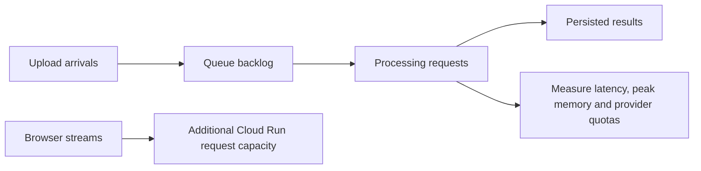

# Capacity and cost

Choose limits from measured processing time, memory, provider quotas and arrival rate. Registered user count alone does not establish capacity.

## Capacity model

```text
Files/month = active users × files/user/month
Average occupied slots = files/second × mean processing seconds
Throughput/hour ≈ concurrent processing slots × 3,600 / mean processing seconds
```

Use the same time window for arrival rate and processing time. These formulas estimate steady-state averages; peak demand, startup and failures require headroom.



Cloud Tasks queue concurrency controls outstanding deliveries. Cloud Run request concurrency also includes uploads and event streams. Instance limits and database connection budgets must accommodate both. Timed-out work may survive cancellation; queue concurrency is not a global execution-slot guarantee.

The [Cloud Run guide](../deployment/cloud-run.md) gives example deployment settings. Measure before treating those values as production limits.

## Cost drivers

| Component | Measure |
| --- | --- |
| Cloud Run | Allocated CPU/memory, billable time, startup and open streams. |
| Cloud Tasks | Task creation, delivery and retries. |
| Cloud Scheduler | Scheduled maintenance jobs. |
| Cloud Storage | Retained inputs, abandoned uploads, object versions, operations and transfer. |
| Supabase | Database/auth plan, storage, egress and connection limits. |
| OpenRouter | Actual billed extraction tokens and repeated calls. |
| TypeSafe | Classification usage and repeated calls. |
| Optional tracing | Trace volume and retention. |

Calculate model costs using the actual configured provider and model. The extraction model is selected in [the classifier workflow](../../src/workflows/trx_classifier/workflow.py), and classification in [the Jev adapter](../../src/tools/single_model/jev.py). A Google model's direct API price is not necessarily its OpenRouter price.

Use current provider pricing rather than copying rates into this guide: [Cloud Run](https://cloud.google.com/run/pricing), [Cloud Tasks](https://cloud.google.com/tasks/pricing), [Cloud Scheduler](https://cloud.google.com/scheduler/pricing), [Storage](https://cloud.google.com/storage/pricing), [Supabase](https://supabase.com/pricing), [OpenRouter](https://openrouter.ai/models), and [TypeSafe](https://docs.typesafe.ai/models).

## Measure before launch

1. Process representative PDF and CSV inputs, including scanned and large documents. Measure cold starts and first model downloads separately.
2. Increase concurrent jobs gradually while keeping event streams open. Record peak memory, latency, provider throttling, queue age and event delay.
3. Record billed model usage across complete attempts, including failed or repeated stages.
4. Measure database connections per process and during deployment overlap. The listener needs a separate session-capable connection.
5. Choose queue rate, instance limits, resource sizes, retry budgets and retention from the results.

Keep dated benchmark results with the tested code revision, hardware, inputs and configuration. They are evidence for a particular deployment, not permanent performance guarantees.
