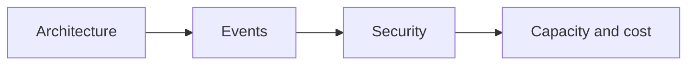

# TRX classifier system design

Four short guides for understanding and implementing the agreed target architecture. They describe the design, not completed application changes.

| Read in order | Question it answers |
| --- | --- |
| [1. Architecture and services](01-architecture-and-services.md) | Who owns the work, and where does data move? |
| [2. Events and live updates](02-events-and-live-updates.md) | How does progress reach the browser without polling? |
| [3. Security and identity](03-security-and-identity.md) | Who may upload, execute, or watch a job? |
| [4. Capacity and cost](04-capacity-and-cost.md) | How much work can we handle, and what drives the bill? |

Each guide opens with a visual model, then responsibilities, important decisions, and source links. Abbreviations are introduced independently in each guide.

**Agreed:** one FastAPI service on Google Cloud Run; Google Cloud Tasks for queued processing; Google Cloud Storage for private Portable Document Format (PDF) files; PostgreSQL event history and `LISTEN / NOTIFY`; Server-Sent Events (SSE) for browser updates. Supabase is the preferred database host discussed.

**Still to specify:** batch request format, retry/group actions, job claim recovery, dispatch recovery, event retention, resource sizes, and deployment limits.

[Interactive architecture: Sequence and Overview](../../../../docs/trx-classifier-architecture.html) · [Existing authentication visualization](../../../../docs/trx-classifier-authentication.html)
